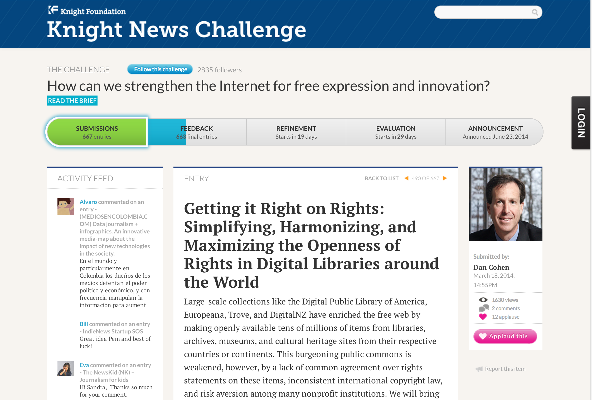

# The Digital Public Library of America
## An Introduction

Mark A. Matienzo   
Director of Technology    
mark@dp.la

New York Archives Conference     
Binghamton, NY    
June 6, 2014

Slides: <http://matienzo.org/presentations/>

Hello! I'm Mark Matienzo, the Director of Technology for the Digital Public Library of America.    
Thank you for giving me the opportunity to speak at NYAC and to travel to the Southern Tier. I grew up about fifteen minutes from here and it's great to be back.    
In this talk, I'll be providing an introduction to the Digital Public Library of America, how we're organized, and the work we do. Both Kerri and I will make sure that we leave plenty of time for questions.

# What is DPLA? {.takahashi}

To start, I would first like to ask you a few questions.   
How many of you have heard of the Digital Public Library of America before?     
How many of you have used DPLA?    
If you're not familiar with DPLA, that's alright!   

--------------------

#  {.takahashi}

The Digital Public Library of America brings together the riches of America’s libraries, archives, and museums, and makes them freely available to the world.    
It strives to contain the full breadth of human expression, from the written word, to works of art and culture, to records of America’s heritage, to the efforts and data of science.   
The "full range of human expression" means all kinds of stuff—cultural heritage materials such as images, sound files, moving images, journals, books, data sets, etc.    
The DPLA aims to expand this crucial realm of openly available materials, and make those riches more easily discovered and more widely usable and used.   

--------------------

, 1833. David Rumsey Maps](images/eagle-map.png)

DPLA has a unique opportunity to connect people across the United States and its territories with cultural heritage materials through a freely accessible site.    
DPLA is a portal that offers users metadata (or records) and content previews (like thumbnails). If a user wants to see a full digital object, they are referred back to a hosting institution’s website.    

# History {.takahashi}

DPLA didn’t just appear one day as a small start-up non-profit.    
Instead, it was the result of a two-year grassroots planning initiative that started in 2010.    
The DPLA planning process began in October 2010 at a meeting in Cambridge, Massachusetts.   
During this meeting, 40 leaders from libraries, foundations, academia, and technology projects agreed to work together to create "an open, distributed network of comprehensive online resources that would draw on the nation’s living heritage from libraries, universities, archives, and museums in order to educate, inform, and empower everyone in current and future ­generations."   
That single sentence banded together hundreds toward a common goal of building a national digital library platform.

-----------------

In December 2010, the Berkman Center for Internet &amp; Society at Harvard University convened leading experts in libraries, technology, law, and education to begin work on this ambitious project.    
A two-year process of intense grassroots community organization, beginning in October 2011 and hosted at the Berkman Center under the aegis of the DPLA Secretariat, brought together hundreds of public and research librarians, innovators, digital humanists, and other volunteers—organized into six workstreams and led by a distinguished Steering Committee—helped to scope, design, and construct the DPLA.
The culmination of all of this hard work was DPLA’s successful launch on April 18, 2013. While the actual in-person celebration event had to be canceled on account of the Boston Marathon bombing, DPLA’s site and services launched right on-time.    
The April launch also marked the transition from the Harvard-based planning phase to what we call DPLA’s operational phase, or the start of DPLA as an independent 501c3 non-profit organization.

# The DPLA is ...

## a Portal
## a Platform
## an advocate for the Public Option

We describe DPLA in three ways:    
First, DPLA is a portal that delivers students, teachers, scholars, and the public to incredible resources, wherever they may be in America.    
Secondly, DPLA is a platform that enables new and transformative uses of our digitized cultural heritage.    
Thirdly, DPLA is an advocate for a strong public option in the twenty-first century.    

# A Portal for Discovery {.takahashi}
## <http://dp.la/>

The DPLA portal is a tool for the discovery of content.     
It currently contains records for over 7 million digital objects that are open and freely accessible to all users anywhere.    
When discussing the DPLA as a portal for discovery, we like to emphasize the "one-stop shop" idea.     
This means that through one portal, you can access many collections with related content and see connections between that content in new ways.    
A search for John Steinbeck might produce results from many different DPLA partners – taken together they represent a more robust collection of Steinbeck material accessed easily through a simple search of one institution or a regional consortium.    
This model means that a record from a small historical society can have the same status in DPLA as a record from a large institution like the National Archives.

------------------

When you first visit DPLA's portal, you are given a variety of ways to find cultural materials. 

------------------

For example, you can perform simple searches, sort the results, and filter them by format, contributing institution or partner, date, language, location, or subject.

------------------

In addition to a familiar search paradigm, we provide a few additional interfaces that allow users to find and interact with collections in new ways.    
The DPLA Timeline uses available time information—year, month, day—to chart records related to a search over time.   
Using the red slider on the right, a user can capture a particular period of time that will display in the blue section at the bottom.    
Within this section, they can click on search results for a particular decade or a particular year (indicated by the vertical bars—longer bars have more results).   
This can make it easier for some users to browse large result sets.

------------------

The DPLA Bookshelf is yet another way that we provide an innovative mechanism for users to interact with materials available through our portal.    
The items on Bookshelf represent digitized books available through the portal, from providers such as the University of California, the University of Illinois, and the New York Public Library.    
The shelf is shown as a vertical stack so that the titles and authors are more easily readable on their spines.    
The width of the book represents the actual height of the physical book, and its thickness represents its page count.    
The spine is colored with one of ten depths of blue to indicate how relevant the work is to the reader's search.

------------------

When a reader clicks on one of the books, additional information about it is displayed to its right. The reader can open the book with the click of a button.    
Further, when a reader clicks on a book, the DPLA Bookshelf displays thumbnails of images within the DPLA collection related to that book’s subject areas.    
Clicking on a thumbnail displays the image and additional information about it.

------------------

In addition, users can explore further by clicking on one of the subjects under which the book has been categorized.    
This replaces the existing shelf with a shelf containing all the other books in the DPLA collection categorized under that same subject.

------------------

Finally, DPLA provides a map interface, which presents items contributed by DPLA partners that have some degree of geographic information included within their metadata.    
It is important to note that not all records in DPLA have geographic information.   
As the box at the top indicates, only records with geographic information appear on the map, and while that is a large portion of the DPLA’s collection, it is not all items related to a search.

------------------

One very common misconception about the DPLA map is that it organizes records geographically by the institutions they come from.     
For example, users of this search might assumed that we have 12,000 items that originate from institutions located in central New York.    
In reality, we have 12,000 items identified as "being about", representing, or depicting central New York – like images taken there.    

------------------

As you zoom in, you can more clearly see the places depicted or represented in these items, based on the information.   

------------------

In addition to these interfaces I've just discussed, DPLA also provides curated exhibitions.   
The exhibitions currently on the site were curated by our partners, and through a pilot project with groups of MLIS students.
Exhibition contibutors work with DPLA content from multiple institutions around a topic of national significance.    
Exhibitions offer some opportunity to create juxtapositions between items, use them in narratives, and give them useful context. We plan to add to our group of exhibitions through a Public Library Partnerships Project which offers digital skills training and content aggregation avenues to public libraries.
I will be describing that project in more detail later in the presentation.
We're particularly interested in the potential exhibitions have for teachers at many levels. They can be a useful way to introduce DPLA to new users.

# A Platform to Build On {.takahashi}
## <http://dp.la/info/developers/>

The DPLA platform is one of the most important parts of our technical infrastructure.    
It provides us, as well as our technically-inclined users, with the ability to search and retrieve metadata ingested from our partners.     
In fact, the Platform directly provides this functionality to the DPLA portal.    
Most importantly, we provide free and open access to the Platform and the metadata available from within it.

# How is it free? {.takahashi}
##  {.incremental}

How is it free? *NEXT*    
As part of the contribution process, we require all of our partners to license their metadata under the Creative Commons CC Zero license.   
This CC license lets creators and owners of copyright-protected content to waive all copyright interests in their works and thereby place them as completely as possible in the public domain, so that others may freely build upon, enhance and reuse the works for any purposes without restrictions under copyright.
In addition to the open licensing for the metadata, we have also released all of our infrastructure - the platform, the portal, and our exhibition code, under open source licenses.

# Platform Data

For those developers that want to work with all of our metadata, or with all of the records from a specific provider at once, we provide a bulk download option.

# The DPLA API {.takahashi}
## Access to millions of items, for any purpose

But the DPLA is not just a database or a website, and it should be easy for a software developer to get started working with our metadata.   
We provide a set of tools that anyone can use to build their own application or interface on top of the DPLA’s aggregated data.    
This toolset is called an Application Programming Interface (API).    
APIs let computer programs talk to other computer programs, enabling application components to fit together like Lego blocks.     
Right now, the API gets more hits than the portal!

------------------

What powers the platform, the portal, and apps is our metadata within the platform.    
DPLA harvests metadata in many different formats, such as Dublin Core, MODS, MARCXML, and others.
As part of the process to bring in a partner's metadata, we map the incoming data to our Metadata Application Profile.
In this process, we also enrich the data, by doing things like parsing date statements to identify start and end dates, identifying what type of the material an item describes (such as text, image, sound, and so forth), and extracting and processing place names.        
Many of our providers include place names or other geographic headings in their metadata, and as part of the enrichment process we identify those headings.   
We send the text of those headings to a geocoding service, which looks them up in a database, and returns a set of latitude and longitude coordinates for that place.    
Once we have those coordinates, we send them back to another service that "reverse geocodes" them and provides us with a full place hierarchy, including country, state or province, region or county, and city, when available.     

------------------

We encourage anyone to build applications and interfaces using our API.
We also provide a public app library, which allows submissions.
Submitting your app to the app library can help with promotion, and helps us demonstrate that people are actively using the API.  
In addition to the apps listed here, apps submitted to the library include OpenPics, an iOS application for access to cultural heritage images, several map-based visualizations, and Serendip-o-matic, a tool that analyzes your research materials for keywords and finds related items in DPLA and other sources.

# A Strong  Public Option {.takahashi}

For most of American history, the ability to access materials for free through public libraries has been a central part of our culture.   
The DPLA works with others to ensure that this critical, open intellectual landscape remains vibrant and broad in the face of increasingly restrictive digital options.   
The DPLA seeks to multiply openly accessible materials to strengthen the public option that libraries represent in their communities.

------------------

 Photo by Leslie Jones. © Leslie Jones. CC BY-NC-ND. 
Boston Public Library via Digital Commonwealth](images/carnegie.png)

Like Andrew Carnegie opening libraries to the masses for free lending—free knowledge, we like to think that DPLA is helping to unlock and open up access to the wealth of knowledge in our nation’s cultural heritage institutions.     
However, we are not working to replace the physical libraries, archives, and museums, or the great librarians, archivists, curators, and historians working in them.    
Instead, by working together, through partnerships that (first) bring together our nation’s rich and varied collections—-books, letters, photographs, journals, posters, oral histories, music, film, and works of art and (second), DPLA can help its partners enhance those collections through new ways of interaction that none of us have yet imagined.

------------------

As an aggregator of metadata from many institutions, DPLA is in a unique position to help our partners recognize and manage data quality issues.   
In October 2013, Europeana and the DPLA organized a first joint rights management workshop to explore this possibility in Boston, Massachusetts.    
As a result of further discussions between the DPLA and Europeana, a small joint working group to explore the possibilities for concrete collaborations in more detail has been established.
This important work will, above all, make rights clear to the end user and provide a framework for aggregators and our partners.    
With the creation and standardization of actionable rights statements, users will know when a work is in the Public Domain, covered under a Creative Commons license or is Rights Restricted, among other possible labels.
In addition, we recently submitted an entry to the Knight Foundation's Knight News Challenge to potentially support this work. 

# How is this possible? {.takahashi}

Now, you may wonder how this is possible, because those seven million items had to come from somewhere.
In addition, DPLA has a small staff - currently, we're eight full time employees and one intern.   
There's no special magic here - just lots and lots of collaboration.

# DPLA Hubs {.takahashi}

We have a partnership model which we refer to as our "hubs model."    
The Hubs Program is designed to establish a national network of state and regional digital libraries, as well as large institutional digital libraries.    
The hubs model allows us to bring together digitized content from across the country into a single access point for end users, and an open platform for developers.

----------------

The DPLA Content Hubs are large digital libraries, museums, archives, or repositories that maintain a one-to-one relationship with the DPLA.    
Content hubs tend to be larger, with collections exceeding 250,000 records and content previews (such as thumbnails or low resolution clips of audio/visual material).
Content hubs work with DPLA to make their metadata globally interoperable, meaning that they work with DPLA to normalize, clean, update their data, and investigate new methods for data sharing.

-----------------

The DPLA Service Hubs are state or regional digital libraries that aggregate information about digital objects from libraries, archives, museums, and other cultural heritage institutions within its given state or region.    
Like content hubs, service hubs share metadata and content previews and work with DPLA to make their metadata globally interoperable. 
In addition, service hubs also represent their community as single metadata aggregation point (state, region, etc., but perhaps differently defined communities in the future).   
Each Service Hub also offers its state or regional partners a full menu of standardized digital services, including digitization, metadata, data aggregation and storage services, as well as locally hosted community outreach programs, bringing users in contact with digital content of local relevance.   

------------------

We also have two service hubs and four content hubs waiting in the wings. Getty, Indiana, Gov’t Printing Office, Connecticut, and California Digital Library.

------------------

# 

This is a map of both current hubs and those which are in progress, indicating states with active service hubs, the partner states for service hubs, and the location of content hubs.

------------------

# A Network of Partners

But the DPLA is really made up of over 1,300 partners - institutions and organizations from across the US - that provide content to or are hosted by (or have some other relationship with) our Hubs.    
In turn, the Hubs serve up this content to DPLA. 

------------------

This chart represents the breakdown in terms of types of partners whose content is represented in DPLA.    
As you can see, there is a wide range of types of institutions, including government agencies, museums, historical societies, academic libraries, and so on.

------------------

WHY THE THE HUBS MODEL? Sustainability!
    
The image on the left shows that one-to-one partnerships can be resource intensive, requiring more staffing and processing power to ingest and update, and to continually manage the variety of individual metadata standards and quality and feed types.    
The image on the right, however, represents that the Service and Content Hubs model supports the sharing of responsibilities for metadata management and feeds. It encourages collaboration, which in turn increases the likelihood of more complete and higher quality metadata and sustainable curation models. 

------------------

I like to think of us more like a water cycle, wherein all partners play an equally visible and valuable role in the content sharing process.

# Benefts for Partners {.takahashi}

Partners who contribute their metadata to DPLA themselves also benefit from their participation in a number of ways, including increased access, increased visibility, and increased usage.

# Increased Access {.takahashi}

We'll first talk about increased access and the network effects that DPLA participation provides to its partners.

------------------

, 1907?. Nicollet County Historical Society, Minnesota Digital Library](images/maxwell-1.png)

For example, The Maxwell automobile company was formed in 1904 and ceased to exist in 1925.    
You love Maxwell cars: How do you know that the image even exists?

------------------

# 

This image is from the Nicollet County Historical Society in St. Peter, Minnesota.    
The historical society doesn't have a digital collection on their website.   
You’ve never heard of Nicollet County or even St. Peter, since you don't live in Minnesota.

------------------

Luckily, Nicolett County Historical Society works with the Minnesota Digital Library, which manages their digital collections. Luckily, MDL works with DPLA.    
And, luckily for you, you’ve found DPLA and all of the Maxwell Automobile images available from six institutions across the US, including that one from the NCHS.    
The luck continues--now you know about MDL because you’ve followed the link back to their site to see that awesome image.    
And, maybe now you know that the NCHS exists.   
And, just maybe you’ll visit their site, contact them, or spread the good word about how you found that image and where it comes from.

# Increased visibility 

"... [DPLA’s] holdings, which come from institutions ranging from the Smithsonian and the New York Public Library to the **Minnesota Streetcar Museum** and the Montana Memory Project, include items in more than 400 languages ...""

[New York Times ArtsBeat blog, April 22, 2014](http://artsbeat.blogs.nytimes.com/2014/04/22/digital-public-library-of-america-marks-a-year-of-rapid-growth/)

By participating in a national network, DPLA partners also benefit from promotion around DPLA itself.    
For example, DPLA's first anniversary was recently covered by a blog on the New York Times ArtsBeat blog.    
Staff from the Minnesota Streetcar Museum saw a spike in usage of their materials on the days following the publication of this blog post. 

# Increased usage

* 1 million unique visitors to DPLA site in first year
* Minnesota Digital Library: 55% increase in traffic since April 2013 DPLA launch
* Mountain West Digital Library: 100% increase in both number of visitors and number of visits

# Words from our Partners

> "The DPLA ... throws open the door for people to find [Minnesota’s digital content] from across the country and across the globe.""
>
> — Jennifer Jones, Minnesota Historical Society
>
> "These tools (the Minnesota Digital Library and the Digital Library of America) will help us build, preserve, and honor this contemporary experience, and preserve it in a way that is going to enrich ... community building ... [with the cultural heritage institutions across the state of Minnesota].""
> 
> — Kit Hadley, Director, St. Paul Public Library

# Partnership = Local Connections {.takahashi}

As you can see, the hubs model allows local collections to become more easily discoverable.    
The hubs help us obtain the content, as well as the partners that provide that content, both serve a vital function.    
The hubs help mediate the relationship between the partners and DPLA.   
The partners are the local institutions with direct expertise and knowledge in the collections and related topics.    
Specifically, the partners and hubs provide an important *local* connection.

# Public Library Partnerships Project

Funded by Bill and Melinda Gates Foundation

Partnering with four service hubs:    

* Digital Commonwealth
* Digital Library of Georgia
* Minnesota Digital Library
* Mountain West Digital Library 

<http://dp.la/info/about/projects/public-library-partnerships/>

DPLA has another opportunity to help strengthen the local connection between hubs and the areas they serve.   
With the Public Library Partnerships Project, DPLA has the opportunity to provide public librarians in a small number of states with digital skills training.    
This project also allows public librarians in libraries with special collections to connect with their local service hub, which can provide additional resources at the state or regional level.     
The project will host 12 total workshops that will reach approximately 180 public librarians, teaching skills such as writing for the web, exhibition development, and understanding intellectual property rights.    
At the conclusion of the project, we will release a public version of the training materials that others can reuse.
Through PLPP, more public library content will appear in DPLA.   
Although the quality and sustainability of relationships between DPLA, Hubs, and public libraries is the bigger project priority, we will also be happy to grow our number of public library partners and establish an even stronger local connection.

# Participating in DPLA {.takahashi}

Now that I've spoken about DPLA and some of the benefits we provide, you might be wondering how you can participate in DPLA!

# 

The first option is to join or create a hub.    
Kerri will be talking more specifically about the Empire State Digital Network, which is the service hub for New York state, but I will give you a brief overview of the process of what starting a new hub looks like.

# Hub Creation Process

* Consider your Hub type (or consult with us)

* Find some partners!
* Contact us (content@dp.la)
* Agree to open your metadata as public domain under a CC0 license
* Sign the data exchange agreement
* Map your data to our metadata application profile (we'll help)
* Provide a single source (a feed or endpoint) so we can grab your data
* Start sharing!

<http://dp.la/info/get-involved/partnerships/>

------------------

You can also build apps using our API, like the ones I discussed before and those listed here.    
We encourage the independent development of applications, tools, and resources that make use of data contained in the DPLA platform in new and innovative ways, from anywhere at anytime.

------------------

Every month DPLA’s Board of Directors and its various committees hold monthly calls which are open to the public.    
Open Board calls are monthly open conference calls held by DPLA’s Board of Directors.     
Open Committee calls are a monthly series of open conference calls, separate from the open Board calls, focused on topics related to our operational committees.   
Anyone can join the open calls, either just by listening in or asking questions.

# Community Reps {.takahashi}

DPLA also has a formally organized volunteer program, called the Community Reps program.    
In September 2013, DPLA staff conceived of a program of community representatives, or volunteers that would help spread the word about DPLA.    
While DPLA was still in its planning phase, my colleagues found that our web forums and committees provided a forum for interested and motivated people to help out and give us feedback.    

# Meet the Reps

Our first class of community reps was announced in January 2014, and we admitted a second class of community reps in May 2014.
We admitted approximately 100 people in the each class, and the Reps include representation from K-12 education, public libraries, state libraries, municipal archives, public history and museums, publishing, media, genealogy, and many areas of higher education.    
Proposed activities by our initial class of reps include creating materials to leverage DPLA as a teaching and learning resource, hackathons and other events targeted at software developers, and outreach to rural public libraries.   
Community Reps are assigned a contact that is a full-time DPLA employee, to whom they can direct any questions, and are provided with basic training through a webinar.

----------------

# Where are Reps located?

Our first class of Community Reps comes from 36 out of 50 states and two countries outside of the US, and helps to extend our outreach significantly.    

# Responsibilities of Community Reps

Represent DPLA formally and informally

Organize activities that promote DPLA using DPLA materials

Share materials and feedback from outreach efforts

Check in with DPLA staff about progress and share experiences

Be willing to participate in speaking or event opportunities as requested by DPLA

While Community Reps are volunteers, DPLA provides a small set of responsibilities that we use to help guide their efforts.   
First, we expect Community Reps to represent DPLA both formally, through recognition on our website, and informally, through various networks or organizations. 
Secondly, we ask them to organize at least one activity or event that help spread the word about DPLA as a portal, platform, or public option.   
We provide Community Reps with materials such as presentations, flyers, and so forth, and supply them with DPLA merchandise to give away, such as t-shirts, stickers, and mugs.    
Thirdly, we ask them to publicize their own efforts through means such as writing posts for the DPLA blog or aggregating notes or tweets from an event or activity.  
We also expect Community Reps to check in with a DPLA staff member on a roughly quarterly basis.    
Finally, we may ask Community Reps on occasion to give a presentation or participate in an event at our request.
For example, if they are attending or live near a conference at which the organizers have asked for a DPLA presentation, we may ask them to take this on if DPLA staff are unable to participate.

# Thank You! {.takahashi}

[\@anarchivist](https://twitter.com/anarchivist)

<mark@dp.la>

<http://matienzo.org/presentations>

DPLA continues to work to help unlock and provide greater access to these resources for the benefit of all.    
Thank you for your time!

